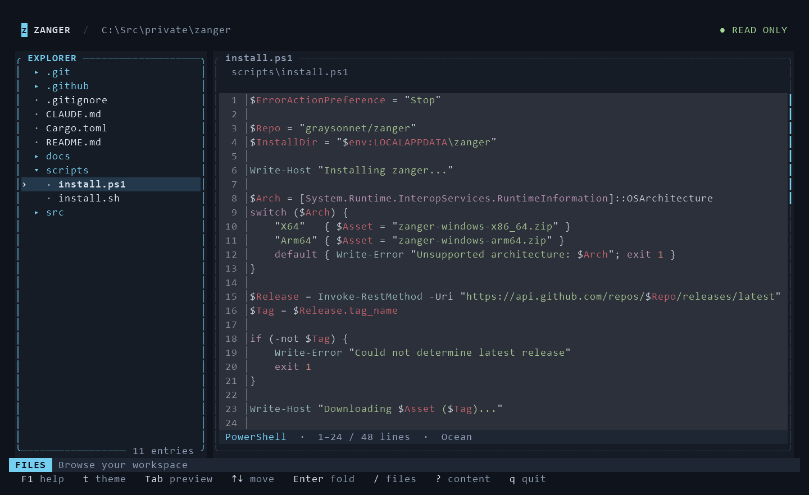
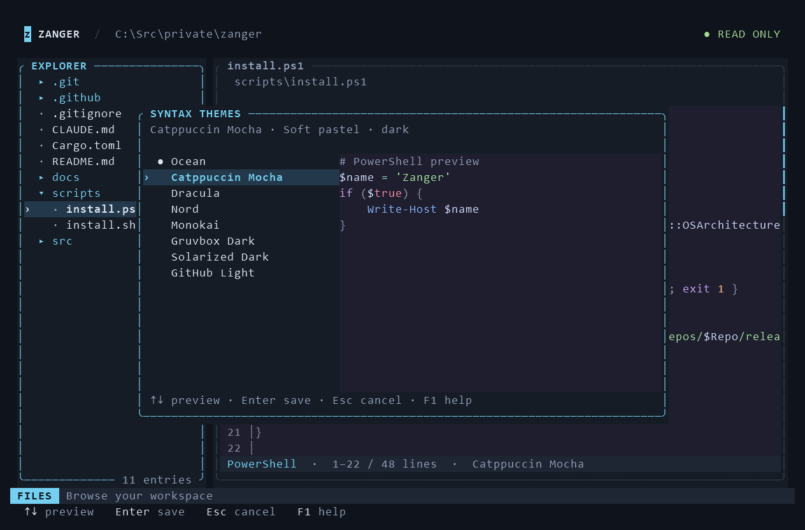
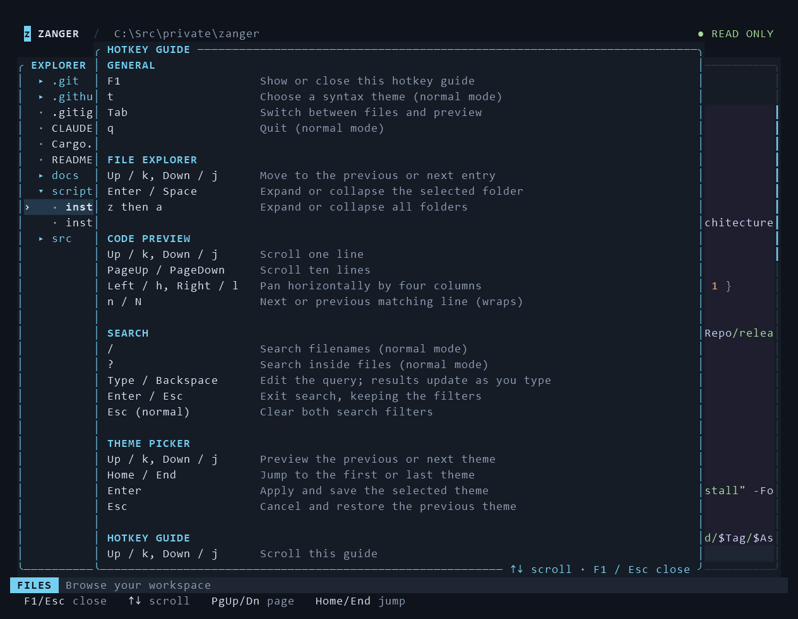

# Zanger

Zanger is a fast, read-only terminal file explorer written in Rust. Browse your workspace in a compact sidebar, read syntax-highlighted code, and search across files while respecting `.gitignore`.

## UI Preview



A dark slate palette, cyan focus borders, and contextual keyboard hints keep the interface clear. Below 78 terminal columns, only the focused pane is shown; use `Tab` to switch between the explorer and preview.

## Features

- **Tree View File Explorer** — Collapsible nested directories with fold/expand support.
- **Code Preview** — Line numbers, a scrollbar, language details, and horizontal scrolling for long lines.
- **Syntax Highlighting** — Powered by `syntect` and the `two-face` syntax bundle. Includes PowerShell scripts (`.ps1`), modules (`.psm1`), and data files (`.psd1`).
- **Theme Picker** (`t`) — Eight syntax themes with live preview and a saved preference.
- **Hotkey Guide** (`F1`) — A scrollable keyboard reference, available from any screen.
- **File Name Search** (`/`) — Instantly filter the file tree by path.
- **Content Search** (`?`) — Fast ripgrep-like deep content search powered by `rayon` parallel processing and `bstr` byte matching.
- **Search Result Highlighting** — Amber highlights mark matching text and line numbers. Active filters stay visible in the status bar.
- **Match Navigation** — Use `n`/`N` to jump between content search matches within a file.
- **Cross-Platform** — Runs natively on Linux, macOS, and Windows (x86_64 and ARM64).

## Installation

### Quick install (Linux / macOS)
```sh
curl -fsSL https://raw.githubusercontent.com/graysonnet/zanger/main/scripts/install.sh | bash
```

### Quick install (Windows PowerShell)
```powershell
irm https://raw.githubusercontent.com/graysonnet/zanger/main/scripts/install.ps1 | iex
```

The Windows installer adds `%LOCALAPPDATA%\zanger` to your user PATH and the current PowerShell session, so you can run `zanger` immediately. Re-running the installer does not duplicate the PATH entry.

### From source
```sh
cargo install --path .
```

### Usage
```sh
zanger              # Explore current directory
zanger /path/to/dir # Explore a specific directory
zanger --help       # Show help
zanger --version    # Show version
```

## Syntax themes



Press `t` in normal mode to open the theme picker. Use `Up` / `Down` or `k` / `j` to preview a theme, `Enter` to apply and save it, or `Esc` to restore your previous theme. `Home` / `End` jumps to the first / last option. The picker includes a PowerShell sample even when no file is selected.

| Theme | Appearance |
|-------|------------|
| Ocean (default) | Muted blue |
| Catppuccin Mocha | Soft pastels |
| Dracula | Vivid purple accents |
| Nord | Cool blues |
| Monokai | Bright accents |
| Gruvbox Dark | Warm earth tones |
| Solarized Dark | Low contrast |
| GitHub Light | Light background |

Themes set the code foreground, background, and text styles. The explorer and controls retain their dark palette. Theme previews preserve your selected file, scroll position, and search filters.

Your confirmed choice is stored in `%APPDATA%\zanger\syntax-theme` on Windows, `~/Library/Application Support/zanger/syntax-theme` on macOS, or `$XDG_CONFIG_HOME/zanger/syntax-theme` (falling back to `~/.config/zanger/syntax-theme`) on Linux. An unknown or missing preference uses Ocean; a save failure keeps the theme for the current session and displays a message.

## Keybindings

Press `F1` at any time for the in-app hotkey guide, or run `zanger --help`. In the guide, use `Up` / `Down` (`k` / `j`), `PageUp` / `PageDown`, or `Home` / `End` to scroll. Close it with `F1` or `Esc` to return to your previous screen.



### Navigation
| Key | Action |
|-----|--------|
| `q` | Quit |
| `F1` | Show or close the hotkey guide |
| `t` | Open the syntax theme picker (normal mode) |
| `Tab` | Switch focus between file list and content pane |
| `j` / `Down` | Navigate down (file list) or scroll down (content) |
| `k` / `Up` | Navigate up (file list) or scroll up (content) |
| `PageDown` | Scroll content down by 10 lines |
| `PageUp` | Scroll content up by 10 lines |
| `h` / `Left`, `l` / `Right` | Scroll content horizontally by 4 columns |
| `Enter` / `Space` | Toggle fold/expand selected directory |
| `za` | Toggle fold/expand all directories |

### Search
| Key | Action |
|-----|--------|
| `/` | Enter file name search mode |
| `?` | Enter content search mode |
| Typing / `Backspace` | Edit the current query; results update immediately |
| `n` | Jump to next content match |
| `N` | Jump to previous content match |
| `Esc` / `Enter` | Exit search mode and keep the filters |
| `Esc` in normal mode | Clear both search filters |

Navigation shortcuts apply in normal mode. While editing a search, letters such as `t`, `j`, and `q` are entered as text. `?` searches file contents; `F1` opens help.

## Architecture

See [docs/architecture.md](docs/architecture.md) for details on the module structure.

## License

MIT
